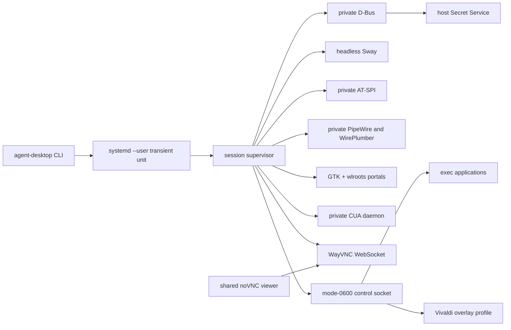

# Agent Desktop End-to-End Acceptance Specification

## 1. Purpose

This specification defines the full, activated-system acceptance suite for
`agent-desktop`. It tests real NixOS and Home Manager integration, transient
systemd units, graphical processes, portals, PipeWire, CUA, VNC, Vivaldi,
Secret Service sharing, concurrent sessions, and lifecycle reclamation.

These are end-to-end tests. The package's Pytest suite remains the fast test
layer and does not replace this specification.

## 2. Scope

The suite MUST prove:

- an activated NixOS generation exposes the expected CLI and configuration;
- the golden Vivaldi profile is prepared before graphical login;
- one or more private Sway desktops can run without using the primary desktop;
- every session-owned process and endpoint has the intended ownership;
- arbitrary commands and Vivaldi can be launched through the session supervisor;
- accessibility, visual computer use, VNC, portals, and shared secrets work;
- normal shutdown and forced failure reclaim all ephemeral resources.

Browser automation through CDP, Playwright, or WebDriver is out of scope.
Vivaldi is exercised through accessibility, screenshots, keyboard, and pointer
computer-use paths only.

## 3. Safety contract

The suite MUST:

1. Run as the same Unix user as the interactive desktop.
2. Use unique session IDs prefixed with `e2e-`.
3. Use only temporary fixture files and temporary Secret Service entries.
4. Never launch an agent application on the primary Wayland display.
5. Never write directly into `~/.config/vivaldi` or the golden profile.
6. Install cleanup traps before creating the first session.
7. Preserve evidence outside the session runtime directory before teardown.
8. Finish with no test sessions, units, processes, mounts, secrets, or viewer
   tokens.

The suite MAY remove its own stopped session-state JSON records after recording
that `destroy` returned `stopped`. Production state retention is not a failure.

## 4. Preconditions

The operator MUST switch to the candidate NixOS generation before running the
suite. A package-only build is insufficient for this suite.

Required commands include:

```text
agent-desktop
busctl
cua-driver
curl
findmnt
hyprctl
jq
secret-tool
systemctl
```

The portal stream test additionally needs a client capable of:

- creating and starting an XDG ScreenCast session;
- opening its portal-scoped PipeWire remote;
- consuming one raw video frame.

The suite begins only when:

```bash
command -v agent-desktop
agent-desktop list --all --json
systemctl --user list-units 'agent-desktop-*.service' --all
findmnt -rn -t fuse.fuse-overlayfs
```

show no pre-existing agent desktop sessions, units, or mounts. Existing
non-agent FUSE mounts are irrelevant.

## 5. Test topology



## 6. Common variables and evidence directory

Each run SHOULD establish:

```bash
RUN_ID="$(date +%Y%m%d-%H%M%S)"
EVIDENCE="/tmp/agent-desktop-e2e-$RUN_ID"
PRIMARY="e2e-primary-$RUN_ID"
SECONDARY="e2e-secondary-$RUN_ID"
mkdir -m 0700 "$EVIDENCE"
```

Machine-readable command results, screenshots, portal frames, relevant journal
output, and before/after host state MUST be copied into `$EVIDENCE`.

## 7. Acceptance tests

### E2E-001 — Activated package and generated configuration

Procedure:

1. Resolve `agent-desktop` from the active user profile.
2. Resolve `~/.config/agent-desktop/config.json` through its symlink.
3. Record the package, configuration, CUA, Vivaldi, portal, and noVNC store
   paths.
4. Run `agent-desktop --help`.

Required results:

- the CLI includes `create`, `destroy`, `exec`, `browser`, `list`, `status`, and
  `view`;
- all configured command paths are executable;
- the CUA path is the project's patched `packages.cua-driver` output;
- the system CUA service and agent desktop configuration resolve to the same CUA
  store path;
- telemetry is disabled in the CUA environment.

### E2E-010 — Golden Vivaldi profile service

Procedure:

1. Inspect `agent-desktop-vivaldi-golden-raptor.service`.
2. Verify its most recent invocation completed successfully.
3. Verify ordering relative to `display-manager.service`.
4. Inspect the fixed golden directory and ready marker.
5. Create a content manifest of the golden profile before session tests.

Required results:

- the service is enabled and succeeded;
- it is ordered after local filesystems and before the display manager;
- the destination is always
  `~/.local/state/agent-desktop/browser-golden/vivaldi`;
- `.agent-desktop-ready` exists and is mode `0600`;
- singleton files, `DevToolsActivePort`, and `Crash Reports/` are absent;
- the golden directory is not modified by any later session test.

### E2E-020 — Session creation and systemd ownership

Procedure:

```bash
agent-desktop create e2e-primary --session-id "$PRIMARY" --json
```

Record `systemctl --user show` and `systemd-cgls` for the unit.

Required results:

- creation completes within `create_timeout_seconds + 2`;
- state becomes `ready`;
- the transient unit is active and type `notify`;
- `KillMode=control-group`;
- `RuntimeDirectory` is the session's derived runtime directory;
- `RuntimeDirectoryMode=0700` and `UMask=0077`;
- `RuntimeMaxSec` matches the configured runtime limit;
- the cgroup contains the supervisor and all required child services;
- no session process belongs to the primary compositor's cgroup.

### E2E-021 — Runtime ownership and endpoint permissions

Required endpoints include:

```text
bus
at-spi/bus
control.sock
cua.sock
pipewire-0
sway-ipc.*.sock
wayland-*
wayvnc.sock
wayvncctl.sock
```

Required results:

- the runtime root is mode `0700`;
- `control.sock` and `cua.sock` are mode `0600`;
- socket paths are below the session runtime root;
- state paths match paths derived from the session ID;
- `control_socket` is present in `status --json`;
- the session does not inherit the host `WAYLAND_DISPLAY`, `SWAYSOCK`,
  `DISPLAY`, `SSH_AUTH_SOCK`, or arbitrary credential variables;
- an environment probe launched with `agent-desktop exec` observes only the
  private graphical and bus environment.

### E2E-030 — Private service readiness

Inspect the private D-Bus and AT-SPI bus using their addresses from session
state.

Required private D-Bus owners:

```text
org.a11y.Bus
org.freedesktop.impl.portal.desktop.gtk
org.freedesktop.impl.portal.desktop.wlr
org.freedesktop.portal.Desktop
org.freedesktop.secrets
```

Required results:

- `org.a11y.atspi.Registry` owns its name on the private AT-SPI bus;
- `org.a11y.Status.IsEnabled` is `true`;
- `org.a11y.Status.ScreenReaderEnabled` is `true`;
- the private PipeWire socket accepts `pw-dump`;
- a private WirePlumber instance is present in the PipeWire graph;
- hardware audio, Bluetooth, and video-capture monitoring remain disabled;
- logs contain no initialization failure.

### E2E-031 — Portal interfaces and real media operations

Required properties:

- ScreenCast version is at least 4;
- Screenshot version is at least 2;
- ScreenCast source types include monitor capture.

Screenshot procedure:

1. Issue a real `org.freedesktop.portal.Screenshot.Screenshot` request on the
   private bus.
2. Keep the requesting D-Bus connection alive through the response signal.
3. Copy the returned file URI into `$EVIDENCE`.

Screenshot acceptance:

- response code is zero;
- the returned PNG is non-empty;
- dimensions equal the configured output dimensions;
- pixels visibly belong to the private Sway output.

ScreenCast procedure:

1. Create a monitor ScreenCast session.
2. Select sources and start it.
3. Open the portal-scoped PipeWire remote FD.
4. Consume at least one compositor frame.
5. Save frame metadata and a checksum.

ScreenCast acceptance:

- CreateSession, SelectSources, and Start succeed;
- a non-zero PipeWire node ID is returned;
- the restricted PipeWire FD opens;
- one BGRx 1280x720 frame contains exactly 3,686,400 bytes for the default
  configuration;
- the frame is not a uniform or empty buffer;
- the portal session and FD remain alive until frame consumption completes.

### E2E-040 — Browser overlay isolation

Inspect the browser mount and profile before launching Vivaldi.

Required results:

- the profile is a `fuse.fuse-overlayfs` mount;
- the lower directory is the fixed golden profile;
- upper and work directories are session-specific persistent-state paths;
- the merged mount is below the runtime directory;
- `Crash Reports/` is absent in the merged profile;
- `Default/Preferences.profile.exit_type` is `Normal`;
- `vivaldi.startup.crash_detection_last_seen_version` is absent;
- writes appear only in the upper layer;
- the golden content manifest remains unchanged.

### E2E-050 — Exact-argv `exec`

Launch a command containing spaces and shell metacharacters:

```bash
VALUE='exact value ; $(not-executed)'
agent-desktop exec --json "$PRIMARY" -- \
  bash -c 'printf %s "$1" > "$2"' _ "$VALUE" "$RUNTIME/exec-oracle"
```

Required results:

- JSON returns a positive PID and the exact argument array;
- the oracle file contains the literal value, including metacharacters;
- no shell expansion occurs in the control protocol;
- the process belongs to the session cgroup;
- output is routed to `logs/app-*.log`;
- a normally exiting application does not fail the desktop.

Negative case:

```bash
agent-desktop exec "$PRIMARY" -- /definitely/missing-agent-command
```

Required results:

- the command fails with a launch error;
- the session remains `ready`;
- all critical services remain healthy.

Lifecycle fixture:

```bash
agent-desktop exec --json "$PRIMARY" -- sleep 600
```

Keep this PID for teardown verification.

### E2E-060 — First-class Vivaldi launch

Create a local HTML fixture with:

- a unique page title;
- a labelled text input;
- a button that changes the page title using the entered value.

Launch it with:

```bash
agent-desktop browser --json "$PRIMARY" "file://$FIXTURE"
```

Required launch arguments include:

```text
--user-data-dir=<session browser profile>
--no-first-run
--no-default-browser-check
--force-renderer-accessibility
--new-window
```

Required results:

- the returned PID belongs to the session cgroup;
- Vivaldi uses the session overlay, never `~/.config/vivaldi`;
- the expected window appears only in private Sway;
- the accessibility tree is not degraded;
- the tree contains the labelled input and button;
- the tree contains a substantial real browser hierarchy, not metadata-only
  fallback;
- a private-output screenshot contains no Vivaldi crash-report banner;
- profile writes appear in the session upper layer;
- the golden manifest remains unchanged.

Default case:

```bash
agent-desktop browser "$PRIMARY"
```

MUST launch `about:blank` successfully.

Invalid schemes and option-like URLs MUST be rejected without affecting the
session.

### E2E-070 — CUA health, capture, semantic action, and pixel fallback

Run through the session's private CUA socket.

Required results:

- `health_report` is overall `ok`;
- AT-SPI capability passes;
- native wlroots capture capability passes;
- required Wayland managers are advertised;
- `get_screen_size` reports exactly 1280x720 at scale 1 for the default config;
- `get_desktop_state` writes a real 1280x720 PNG.

Semantic action:

1. Query Vivaldi's accessibility tree.
2. Address the labelled input or button using its fresh element token.
3. Perform a semantic action.
4. Verify the page-owned result.

Pixel and keyboard fallback:

1. Capture the exact Vivaldi window.
2. Pixel-address its input with foreground delivery.
3. Type a unique value.
4. Pixel-click the fixture button.
5. Require the page title to contain the exact value.

The fallback MUST use the private Sway target and MUST NOT create or focus a
window on the host compositor.

### E2E-080 — Shared Secret Service bridge

Use a random test attribute and value. Install cleanup before storing.

Procedure:

1. Store through the private session bus.
2. Read the same item through the host bus.
3. Read it again through the private bus.
4. Run at least two concurrent private clients with distinct values.
5. Clear all test entries.
6. Confirm host-side lookup no longer finds them.

Required results:

- values match exactly across private and host access;
- all applications on the private bus may access `org.freedesktop.secrets`;
- private applications remain on the private bus for portals and accessibility;
- client-specific bridge connections are released after clients disconnect;
- no test secret remains.

### E2E-090 — Viewer service and authorization

Procedure:

```bash
agent-desktop view "$PRIMARY" --print
```

Required results:

- the shared viewer service becomes active;
- it listens only on `127.0.0.1:6080`;
- `/health` returns success;
- the selector shell and noVNC assets return HTTP 200;
- the token file is mode `0600`;
- the browser URL carries the token only in the URL fragment;
- an API request without the token returns HTTP 401;
- an authorized API request lists the primary session as viewer-available;
- the viewer's selected-session URL identifies `$PRIMARY`.

### E2E-091 — Real noVNC/WayVNC pointer and keyboard input

Connect through the viewer WebSocket proxy and complete an RFB 3.8 handshake.

Required results:

- framebuffer dimensions are exactly 1280x720;
- the server name identifies the selected session;
- WayVNC reports or demonstrably uses `seat0`;
- a pointer sequence of move, left press, and left release activates a control;
- a key event reaches a private-session fixture;
- application-owned oracle files prove both pointer and keyboard activation;
- moving the cursor alone is not accepted as click evidence.

### E2E-100 — Health interval soak

Leave the primary session active for at least
`health_interval_seconds + 2` after all major services and Vivaldi have been
used.

Required results:

- state remains `ready`;
- the unit remains active;
- control socket, browser overlay, VNC, Sway, CUA, portals, and PipeWire still
  pass their health probes.

### E2E-110 — Two concurrent desktops

Create `$SECONDARY` while `$PRIMARY` remains active.

Required results:

- both sessions are simultaneously `ready`;
- both have distinct runtime roots, D-Bus sockets, AT-SPI buses, Wayland
  sockets, Sway sockets, CUA sockets, control sockets, VNC sockets, browser
  mounts, and upper directories;
- both have their own systemd cgroups;
- commands launched in one session never appear in the other Sway tree;
- destroying or crashing one does not affect the other's health.

### E2E-120 — Forced-crash reclamation

Send `SIGKILL` to the secondary session supervisor through systemd.

Required results within `stop_timeout_seconds + 2`:

- the secondary unit becomes terminal and is collected;
- its cleanup unit runs successfully;
- all secondary child processes are gone;
- runtime directory is gone;
- control and VNC sockets are gone;
- browser mount is absent from `findmnt`;
- browser upper/work directory is gone;
- reconciled session state is `failed` with a useful message;
- the primary session remains `ready` and healthy.

### E2E-130 — Normal teardown and application ownership

Before destroying the primary session, confirm that the long-running `exec`
PID and Vivaldi PID are alive.

Run:

```bash
agent-desktop destroy "$PRIMARY" --json
```

Required results within `stop_timeout_seconds + 2`:

- returned state is `stopped`;
- long-running arbitrary application PID is gone;
- Vivaldi and all of its descendants are gone;
- all critical service processes are gone;
- unit and cleanup unit are terminal and collected;
- runtime directory and control socket are gone;
- browser overlay mount and upper/work directory are gone;
- golden profile remains unchanged.

### E2E-140 — Host-desktop isolation

Capture host compositor state before and after the suite.

Required results:

- `hyprctl clients -j` never contains the unique agent fixture titles;
- no agent process uses the host Wayland or Sway/Hyprland socket;
- agent pointer and keyboard oracles occur only in private Sway;
- the controlled host-focus sentinel remains unchanged when the user is not
  independently interacting with the host desktop.

### E2E-150 — Final cleanup

Stop the viewer service after all viewer tests.

Required final state:

```bash
agent-desktop list --all --json
systemctl --user list-units 'agent-desktop-*.service' --all
findmnt -rn -t fuse.fuse-overlayfs
pgrep -af 'agent-desktop|cua-driver|wayvnc|sway'
```

Acceptance:

- no test session records remain after harness-owned record cleanup;
- no agent desktop or cleanup units remain;
- no test processes remain;
- no agent browser FUSE mounts remain;
- no test upper directories remain;
- viewer service is inactive;
- viewer token is absent;
- test Secret Service entries are absent;
- temporary fixture files are removed after evidence has been retained.

Host processes unrelated to the test, including the normal host CUA service and
interactive compositor, MUST be distinguished by cgroup and command line and
must not be terminated.

## 8. Required evidence summary

A passing run SHOULD retain:

```text
active-package-paths.txt
active-config.json
create-primary.json
create-secondary.json
systemd-primary.txt
systemd-secondary.txt
cgroups.txt
runtime-permissions.txt
private-dbus-owners.txt
atspi-status.txt
pipewire-dump.json
portal-properties.txt
portal-screenshot.png
portal-frame.raw.sha256
cua-health.json
cua-desktop.png
vivaldi-window-state.json
vivaldi-after-actions.png
exec-result.json
browser-result.json
viewer-url-redacted.txt
viewer-api.json
rfb-transcript.txt
forced-crash-journal.txt
destroy-primary.json
final-cleanup.txt
golden-before.sha256
golden-after.sha256
host-before.json
host-after.json
```

Secrets and viewer tokens MUST be redacted from retained evidence.

## 9. Pass criteria

The full suite passes only when every mandatory test above passes and final
cleanup is clean. A degraded accessibility tree, cursor movement without an
application click oracle, portal interface introspection without a consumed
frame, or a stopped unit with a remaining FUSE mount is a failure.

If a failure occurs, the harness MUST still run cleanup and preserve the failed
step's logs and state before deleting the runtime directory.
